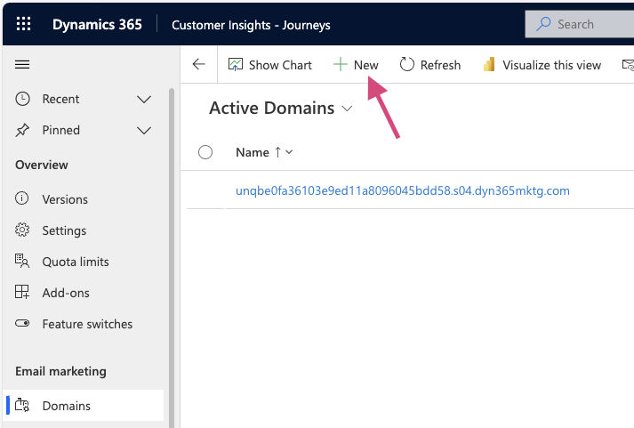

# System Setup: Authenticate Your Domain

[comment]: <> (Export To: `../Web/01_01_AuthenticatedDomains.html`)

**In this article**
 [What is an authenticated domain?](#what-is-an-authenticated-domain)
 [Setup](#setup)

## What is an Authenticated Domain?
An authenticated domain in Microsoft Dynamics 365 Marketing refers to the process of verifying that you own a particular domain name and giving permission to use it for sending emails. This verification process ensures that emails sent from your Dynamics 365 Marketing account are trusted by the recipient's email service provider and not marked as spam.

To authenticate a domain in Dynamics 365 Marketing, you need to create a domain verification record that confirms you own the domain. This record is added to your domain's DNS settings, and once verified, it provides a digital signature that helps to identify your emails as legitimate.

By authenticating your domain, you can improve the deliverability and reliability of your marketing emails, which is essential for any business looking to engage with its customers and drive conversions. Additionally, using an authenticated domain helps to protect your brand's reputation and maintain compliance with email regulations.

## Setup
1. Go to the Settings area of the Marketing app.
2. Click on "Domains" under the "Email Marketing" heading.
3. Click **New**.
    1. 
4. A wizard will be displayed which will guide you through these steps:
    1. Provide your website's domain name.  (Also ensure that the options "Enable external form hosting for this domain" and "Enable email sending for this domain" are checked.)
	2. Create a **TXT** record to verify domain ownership.
	3. Create **CNAME** records to enable email sending for the Marketing app.
	4. Create a final **CNAME** record to enable Envelope-From (i.e Return-Path) domain alignment(fn) and SPF protection functionality.
    5. Once the DNS records are created, return to the wizard and verify the domain.
5. Once the wizard is completed, you will be returned to the form for the new Active Domain record you created.
    1. If you want to use this domain for sending emails (or if you unchecked these options in the wizard), ensure that the "Email Sending" toggle is set to "Enabled".
    2. If you want to use this domain for hosting external forms, ensure that the "External Forms" toggle is set to "Enabled".

>###### Note
> The process of adding DNS records may vary depending on your domain registrar,  so please refer to their documentation(fn) for specific instructions. Additionally, the process may take some time for the DNS changes to propagate, so it's best to wait for a few hours before verifying your domain.